# 🎨 Cisco Packet Tracer - Modernized Icon Pack

A collection of custom-designed, sleek, and modernized icons created to replace the default graphics inside **Cisco Packet Tracer**. Elevate your network topology aesthetics with a cleaner, high-quality layout.

### 🖼️ Preview Layout
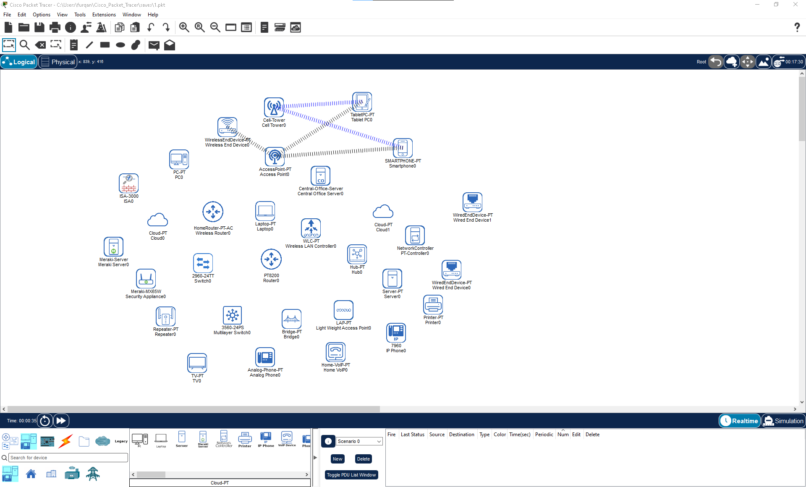

> 🛠️ **Tested Compatibility:** Fully tested and verified with **Cisco Packet Tracer v9.0.1** and above.

---

## 🔍 Icon Gallery Preview

Browse how the individual modernized devices look. The custom assets will render inline below for easy exploration.

### 🛣️ Routers & Switches

| Device Style | Workspace (Logical Canvas) | Component Box (Toolbox UI) |
| :--- | :---: | :---: |
| **Standard Router** |  | 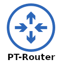 |
| **Home / Wireless Router** |  | 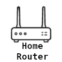 |
| **Linksys Router** |  | 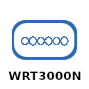 |
| **Standard Switch** |  |  |
| **Layer 3 Switch (3560)** |  | 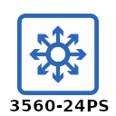 |
| **Hub** |  |  |
| **Repeater** |  | 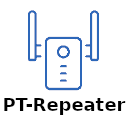 |

### 🛡️ Security, Cyber & Management

| Device Style | Workspace (Logical Canvas) | Component Box (Toolbox UI) |
| :--- | :---: | :---: |
| **ASA Firewall** |  | 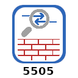 |
| **Cyber Observer** |  |  |
| **Data Historian** |  |  |
| **Network Controller** |  | 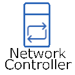 |
| **Meraki Canvas Server** |  <br>  |  <br>  |

### 🌐 Wireless, Cloud & WAN Infrastructure

| Device Style | Workspace (Logical Canvas) | Component Box (Toolbox UI) |
| :--- | :---: | :---: |
| **Access Point (AP)** |  |  |
| **Lightweight AP (LAP)** |  |  |
| **Wireless Controller (WLC)** |  |  |
| **Modem (DSL / Cable)** |  | 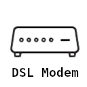 |
| **Cloud (WAN)** |  |  |
| **Cell Tower** |  | 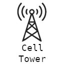 |

### 💻 End Devices & Peripherals

| Device Style | Workspace (Logical Canvas) | Component Box (Toolbox UI) |
| :--- | :---: | :---: |
| **PC Workstation** |  | 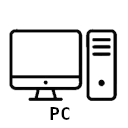 |
| **Laptop** |  | 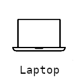 |
| **Server** |  |  |
| **CO Server** |  |  |
| **IP Phone / VoIP** |  <br>  |  <br>  |
| **Tablet / TV / Smartphone**|  <br>  <br>  | 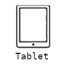 <br> 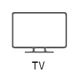 <br>  |
| **Printer** |  |  |

---

## 🚀 Installation Guide

Because Cisco Packet Tracer separates its UI graphics into multiple system paths, you must swap your file directories inside the active Packet Tracer environment folder structure.

### ⚠️ Pre-installation Note
Before overwriting layout folders, close Packet Tracer completely. **Back up your original installation subdirectories** (`ComponentBox` and `Workspace`) to ensure a safe fallback method if required.

### Step 1: Locate Your Packet Tracer Root Installation Folder
Navigate to your active system configuration folder using your local explorer. Default operating paths:

*   **Windows (64-bit):** `C:\Program Files\Cisco Packet Tracer [Version]\`
*   **Windows (32-bit):** `C:\Program Files (x86)\Cisco Packet Tracer [Version]\`
*   **Linux (Ubuntu):** `/opt/pt/`
*   **macOS:** `/Applications/Cisco Packet Tracer.app/Contents/Resources/`

### Step 2: Swap the Selector Drawer Assets (ComponentBox)
The **ComponentBox** directory handles the static flat layout profiles shown in your lower grid choosing window drawer.
1. Open this repository's local file folder: `art/ComponentBox/`
2. Move to your system folder path: `.../Cisco Packet Tracer/art/ComponentBox/`
3. Copy all files from the repository directory and **paste/overwrite** them directly into that installation path folder.

### Step 3: Swap the Grid Board Board Assets (Logical Workspace)
The **Logical** directory targets live vector models that render directly onto your active design board canvas when mapping blueprints.
1. Open this repository's local file folder: `art/Workspace/Logical/`
2. Move to your system folder path: `.../Cisco Packet Tracer/art/Workspace/Logical/`
3. Copy all files from the repository directory and **paste/overwrite** them directly into that installation path folder.

### Step 4: Run Application
1. Start **Cisco Packet Tracer**.
2. Enjoy your upgraded network environment canvas layout!

---

## 📂 Project Architecture Mapping

```text
💾 CiscoPT-Icons/
├── CiscoPT.png             <-- Core Showcase Profile Header Image
└── 📂 art/
    ├── 📂 ComponentBox/    <-- (Map to standard installation path /art/ComponentBox/)
    └── 📂 Workspace/
        └── 📂 Logical/     <-- (Map to standard installation path /art/Workspace/Logical/)
```

---

## 🤝 Contributing & Asset Requests

Want to introduce missing legacy icons or expand device coverage?
1. **Fork** this project.
2. Build out a customized working profile (`git checkout -b feature/NewIconAsset`).
3. Commit revisions (`git commit -m 'Added custom 2960 switch matrix layout variant'`).
4. Generate a project **Pull Request**.

---

## 📜 License

This repository is distributed under the open source **GNU General Public License v3.0** (GPL-3.0). See the [LICENSE](LICENSE) file for usage terms.
